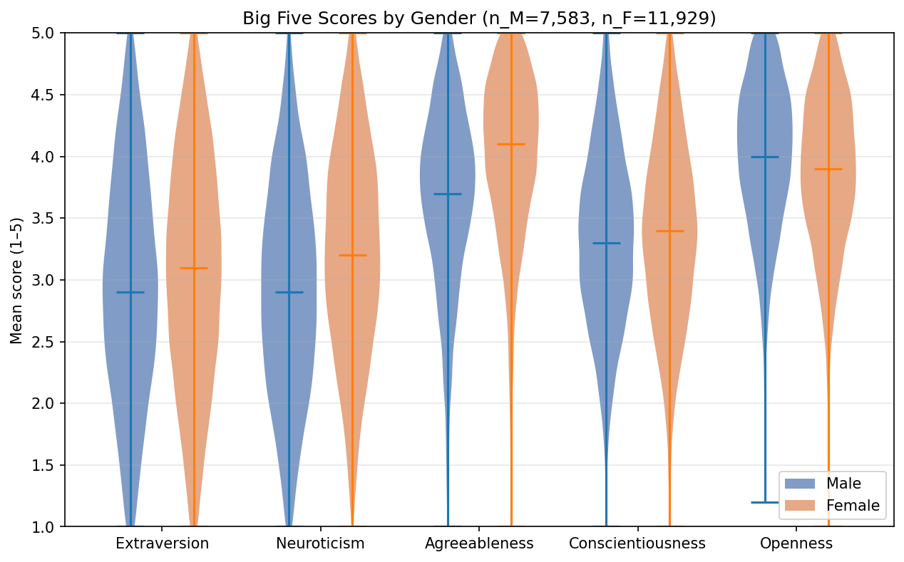
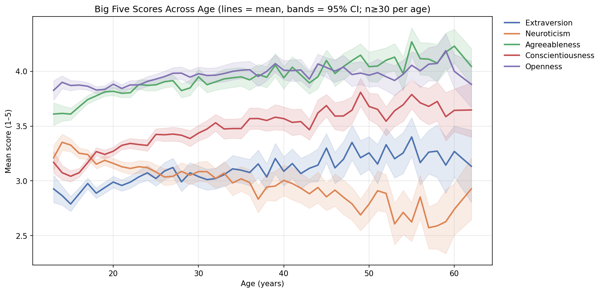

# big5-mini-explorer

> 用 pandas 與 matplotlib 對 Big Five 五大人格資料做迷你探索分析的小專案。

## Live Demo

🚧 **GitHub Pages**：<https://ireneho3507.github.io/big5-mini-explorer/>
（待 push 並啟用 Pages 後填入正式連結）

## Screenshots

### 五因子分數的性別差異



### 五因子分數隨年齡的變化



## Motivation

Big Five（五大人格）是當代心理學最被廣泛採用的人格架構之一。本專案用 [Open Psychometrics Project](https://openpsychometrics.org/_rawdata/) 在 2012 年釋出的網路問卷資料（n ≈ 19,700）做迷你探索，回答兩個問題：

1. **性別差異**：五因子分數在男女之間是否有可觀察的差異？方向是否與既有文獻一致？
2. **年齡梯度**：五因子分數是否隨年齡呈現有意義的趨勢？是否符合人格心理學的成熟原則（maturity principle）？

選用此資料集的理由：(1) 樣本量大、(2) 公開且免授權、(3) 含基本人口統計變項（性別、年齡、國別），足以做描述性與關聯性分析。

## How to run

下列指令以 macOS / Linux 為主；Windows 使用者請依註解切換。

```bash
# 1. Clone repo
git clone https://github.com/ireneho3507/big5-mini-explorer.git
cd big5-mini-explorer

# 2. 建立虛擬環境
python -m venv .venv
source .venv/bin/activate         # macOS / Linux
# .venv\Scripts\Activate.ps1      # Windows PowerShell

# 3. 安裝套件
pip install -r requirements.txt

# 4. 下載資料（檔案不入 git）
#    從 https://openpsychometrics.org/_rawdata/ 下載 BIG5.zip
#    解壓後將 data.csv 與 codebook.txt 放到 data/raw/BIG5/
mkdir -p data/raw/BIG5

# 5. 啟動主分析 notebook
jupyter notebook notebooks/01_explore.ipynb
```

執行 `01_explore.ipynb` 全部 cell 後，會在 `reports/` 重新產生 `figure1_descriptive.png` 與 `figure2_relational.png`。

## Project structure

```
big5-mini-explorer/
├── README.md                          這份文件
├── REFLECTION.md                      作業反思（題目五）
├── requirements.txt                   pip 套件清單
├── .gitignore
├── data/
│   └── raw/BIG5/                      原始資料（data.csv 不入 git）
│       ├── data.csv                   ⬇️ 自行下載
│       └── codebook.txt               變項與題項說明
├── notebooks/
│   ├── style_a_oneliner.ipynb         題目 1.2 — Style A：一句話 prompt
│   ├── style_b_specification.ipynb    題目 1.2 — Style B：規格 prompt
│   ├── style_c_planfirst.ipynb        題目 1.2 — Style C：計畫先行 prompt
│   └── 01_explore.ipynb               題目 2.2 — 主要分析（產 figure1 / figure2）
├── src/
│   ├── __init__.py
│   └── load_data.py                   load_clean_data()：tab 讀取 + age/gender 過濾
├── reports/
│   ├── age_distribution_style_{a,b,c}.png   題目 1.2 三種風格的對照圖
│   ├── figure1_descriptive.png        題目 2.2 — Figure 1
│   └── figure2_relational.png         題目 2.2 — Figure 2
└── docs/
    ├── index.html                     GitHub Pages landing page（題目四）
    ├── figure1_descriptive.png
    └── figure2_relational.png
```

## Prompt Style Comparison

針對「畫年齡分布圖」這個任務，分別用三種 prompt 風格請 AI 助理產出 notebook，比較程式碼品質與可維護性差異。

| Style | 產出能直接跑嗎？ | 程式碼可讀性 (1–5) | 防呆程度 (1–5)（處理 edge case） | 你下次會選哪個？為什麼？ |
|---|---|---|---|---|
| **A. One-liner** | 能跑，但 x 軸被離群值（max ≈ 10⁹）拉到 0–1e9，所有真實資料被壓在第一根 bar | **2**：三行足夠短，但無註解、無結構，無法直接擴充 | **1**：sep、編碼、離群值、路徑全部沒處理 | **不會**：適合 30 秒先看一眼資料，但不適合正式輸出 |
| **B. Specification** | 能跑，但首次因路徑寫法不對應啟動目錄而回報 `FileNotFoundError`，修正後通過 | **3**：有部分註解，但無整體架構說明，新手仍需追讀程式才知道流程 | **2**：有 13–80 年齡過濾、30 bins、dpi=150，但缺 sep 容錯與 encoding fallback | **不會**：規格清楚但缺乏「先驗資料」的計畫步驟，換新資料容易出問題 |
| **C. Plan-first** | 一次到位，無需 debug | **5**：先寫目的與步驟，每段 code 對應一個明確任務，註解清楚 | **4**：有 `utf-8 → latin-1` fallback、`shape[1]==1` 防 sep 錯、`mkdir` 自動建立 reports，但尚缺欄位存在性檢查 | **會**：在產出結果前就能看見計畫並調整，事後也好回顧；換資料集只需改少量參數 |

## Data source & License

- **資料來源**：[Open Psychometrics Project](https://openpsychometrics.org/_rawdata/) — Big Five Personality Test Data (c. 2012)
- **樣本**：19,719 名線上受試者；含 race / age / engnat / gender / hand / source / country 七項背景變項
- **量表**：50-item IPIP Big Five 問卷，5 點 Likert（1 = Disagree、3 = Neutral、5 = Agree、0 = 未作答）
- **使用條款**：依 Open Psychometrics 公告，資料供學術與非商業研究使用；使用時建議引註其網站。
- **codebook**：詳見 `data/raw/BIG5/codebook.txt`（隨資料壓縮檔附）

## Author

Irene Ho（114825002）｜中央大學認知神經科學所｜Spring 2026 NS5116 修課學生
